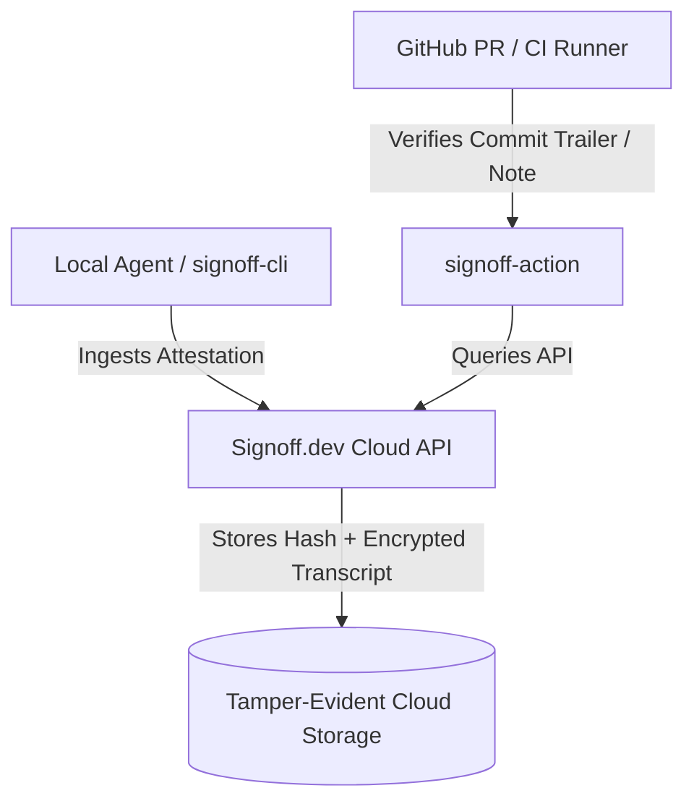

# Future Vision & Architectural Concept: Cloud Attestation Registry (`Signoff.dev`)

**Document Version:** 1.2.0 (Separated Future-Work Concept)  
**Status:** Non-Blocking / Strategic Roadmap  
**Canonical Spec Location:** `skills/signoff/specs/gsa-cloud-concept.md`  
**Core Spec Reference:** [gsa-core.md](gsa-core.md)  
**Lifecycle:** Retained as a scoping reference for future cloud registry work. This concept document will be REMOVED when that work is implemented and replaced by its real specification; it must not be treated as a normative spec in the meantime.  

---

## 1. Executive Summary

The **Git Signoff Attestation (GSA) Core Protocol** ([gsa-core.md](gsa-core.md)) operates 100% locally: the repository records the attestation (trailers, acknowledged risks, transcript digest and byte count), and verification and CI gating never require the cloud. What the repository does NOT hold is the transcript itself — the Socratic conversation lives only as an unmanaged local file on the reviewer's machine, one harness cleanup, disk failure, or departed team member away from unrecoverable.

The registry's **primary purpose is transcript escrow with independent access control**: at signoff time the transcript is archived to the registry; later, a PI, auditor, or compliance reviewer retrieves the conversation directly and verifies it against the `Signoff-Transcript-Digest` / `Signoff-Transcript-Bytes` trailers in git — without depending on the original reviewer or their laptop. Because transcripts capture the entire session (not just the review), their access rules must be independent of the repository's visibility: a public repo with restricted transcripts is the expected configuration. Aggregation dashboards, compliance reporting, and independent ingestion timestamps are secondary value on top of escrow.

**`Signoff.dev`** (placeholder name — final naming TBD; `.dev` preferred, `.human` is not a delegated TLD) represents a commercial cloud registry concept layered on top of the open GSA protocol.

---

## 2. Cloud Registry Architecture (`Signoff.dev`)



### 2.1 API Specification (Draft)

#### Endpoint: `POST /v1/attestations/ingest`
- **Headers:** `Authorization: Bearer <API_KEY>`
- **Payload:**
  ```json
  {
    "harness_id": "claude-code",
    "conversation_id": "session_abc123",
    "reviewed_commit_sha": "e5f6a7b8...",
    "reviewed_tree_sha": "1a2b3c4d...",
    "tradeoffs": ["Surrogate model used for speed in dev"],
    "risks": ["Out-of-bounds inputs return NaN"],
    "reviewer_email": "engineer@company.com",
    "privacy_mode": "full_audit",
    "transcript_hash": "sha256:e3b0c44298fc1c149afbf4c8996fb92427ae41e4649b934ca495991b7852b855",
    "transcript_bytes": 48201,
    "encrypted_transcript_payload": "<base64>"
  }
  ```
- **Response:** `201 Created`
  ```json
  {
    "attestation_id": "att_89f0a21b",
    "digest": "sha256:e3b0c44298fc1c149afbf4c8996fb92427ae41e4649b934ca495991b7852b855",
    "attestation_url": "https://<registry-host>/v1/attestations/att_89f0a21b"
  }
  ```
- `privacy_mode` values:
  - `hash_only`: only the digest is stored; tamper-evidence without retrieval. The transcript never leaves the local machine, and `encrypted_transcript_payload` MUST be omitted.
  - `full_audit` (shown in the example above): the transcript payload (first `transcript_bytes` bytes, encrypted at rest) is escrowed for later retrieval. `encrypted_transcript_payload` is required. This mode is required for the PI/auditor retrieval use case — `hash_only` alone cannot serve it.

#### Endpoint: `GET /v1/attestations/{attestation_id}/transcript`
- `{attestation_id}` is the server-generated opaque identifier returned by the ingest response (e.g. `att_89f0a21b`) — not the commit SHA or conversation ID.
- **Headers:** `Authorization: Bearer <API_KEY>` (access-controlled independently of repository visibility; e.g. PI/auditor roles).
- **Response:** The escrowed transcript payload, decrypted for the authorized caller. Verifiers MUST recompute SHA256 over the first `transcript_bytes` bytes of the **decrypted plaintext** and compare against the `Signoff-Transcript-Digest` trailer in the repository, closing the loop between git and the archive. (The digest is always computed over plaintext transcript bytes — at-rest encryption is a storage concern invisible to verification.)

### 2.2 Tamper Evidence via Transparency Log

"Tamper-evident storage" is implemented as an **append-only transparency log with signed, published checkpoints** (Certificate Transparency / Sigstore-Rekor design): every ingested attestation is an immutable log entry, and external monitors can verify the registry never rewrites history. The registry does not ask to be trusted — it asks to be monitored, which matches the protocol's own thesis of verifiable accountability. Retrofitting verifiability is far harder than starting with it; this is a day-one design constraint for any implementation.

### 2.3 Continuity & Trust Commitments

- **Attestation layer:** git remains the source of truth. If the registry vanishes, every attestation still verifies locally, forever. The registry is an index and witness for attestations — never their custodian.
- **Transcript layer:** in `full_audit` mode the registry IS the custodian of escrowed transcripts — the one data class whose loss is unrecoverable. Durability, incident transparency, and security posture are therefore the product, not overhead.
- **Exit guarantees:** free export of all escrowed data forever, and a documented shutdown/escrow-transfer procedure, committed to publicly before commercial operation begins.

---

## 3. GitHub Action CI Gate (`signoff-action`)

```yaml
name: Signoff Verification Gate
on:
  pull_request:
    types: [opened, synchronize]

jobs:
  verify-signoff:
    runs-on: ubuntu-latest
    steps:
      - uses: actions/checkout@v4
      - name: Verify Git Signoff Attestation
        uses: signoff-dev/signoff-action@v1
        with:
          api-key: ${{ secrets.SIGNOFF_API_KEY }}
          require-signed-commit: true
```

---

## 4. Monetization, Governance & Open-Core Model

* **The free/paid line (committed, not aspirational):** anything required to CREATE or VERIFY an attestation is free and open-source forever — the skill, `signoff-cli`, `signoff-mcp`, transcript adapters, and the local-verification CI action. Paid tiers cover STORING, AGGREGATING, and REPORTING at scale: managed escrow retention, team RBAC, SOC2/AI-governance reporting dashboards. The CI gate must never require the cloud, or the neutrality claim fails.
* **Pricing shape:** free for public repositories and academic use (structural, not promotional — academic adoption is the standard's credibility engine); paid for private/organizational escrow and reporting.
* **Governance intent:** the protocol operator is prepared to cede unilateral control of the GSA spec to neutral multi-party governance as adoption grows. The protocol name (GSA) is freely usable by any conforming implementation; the commercial registry brand is held separately.
* **Positioning:** the defensible asset is trust and coordination-point status (default registry, recognized badge, auditor acceptance), not the software — the registry is deliberately replicable, and the transparency log makes its integrity independently checkable.
