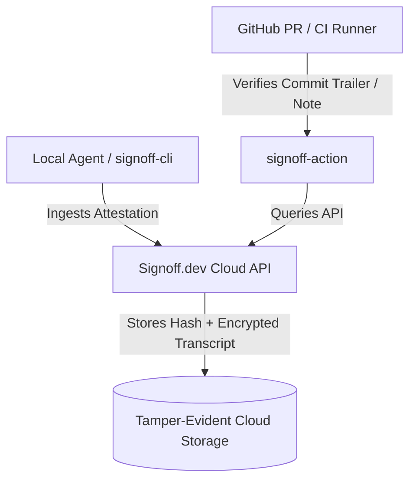

# Future Vision & Architectural Concept: Cloud Attestation Registry (`Signoff.dev`)

**Document Version:** 1.1.0 (Separated Future-Work Concept)  
**Status:** Non-Blocking / Strategic Roadmap  
**Canonical Spec Location:** `skills/signoff/specs/gsa-cloud-concept.md`  
**Core Spec Reference:** [gsa-core.md](gsa-core.md)  
**Lifecycle:** Retained as a scoping reference for future cloud registry work. This concept document will be REMOVED when that work is implemented and replaced by its real specification; it must not be treated as a normative spec in the meantime.  

---

## 1. Executive Summary

While the **Git Signoff Attestation (GSA) Core Protocol** ([gsa-core.md](gsa-core.md)) operates 100% locally with zero cloud dependencies, enterprise engineering teams often require centralized auditability, cross-machine transcript persistence, and automated CI/CD gating.

**`Signoff.dev`** represents a commercial cloud registry concept layered on top of the open GSA protocol.

---

## 2. Cloud Registry Architecture (`Signoff.dev`)



### 2.1 API Specification (Draft)

#### Endpoint: `POST /v1/attestations/ingest`
- **Headers:** `Authorization: Bearer <API_KEY>`
- **Payload:**
  ```json
  {
    "harness_id": "claude-code",
    "conversation_id": "session_abc123",
    "reviewed_commit_sha": "e5f6a7b8...",
    "reviewed_tree_sha": "1a2b3c4d...",
    "tradeoffs": ["Surrogate model used for speed in dev"],
    "risks": ["Out-of-bounds inputs return NaN"],
    "reviewer_email": "engineer@company.com",
    "privacy_mode": "hash_only",
    "transcript_hash": "sha256:e3b0c44298fc1c149afbf4c8996fb92427ae41e4649b934ca495991b7852b855",
    "transcript_bytes": 48201
  }
  ```

---

## 3. GitHub Action CI Gate (`signoff-action`)

```yaml
name: Signoff Verification Gate
on:
  pull_request:
    types: [opened, synchronize]

jobs:
  verify-signoff:
    runs-on: ubuntu-latest
    steps:
      - uses: actions/checkout@v4
      - name: Verify Git Signoff Attestation
        uses: signoff-dev/signoff-action@v1
        with:
          api-key: ${{ secrets.SIGNOFF_API_KEY }}
          require-signed-commit: true
```

---

## 4. Monetization & Open-Core Model

* **Open-Source Standard (GSA):** Core spec, `signoff-cli`, local transcript adapters, and MCP tools are 100% free and open-source.
* **Paid SaaS Tier:** Managed cloud registry, SOC2 AI governance reporting dashboard, team RBAC, and cloud transcript retention.
