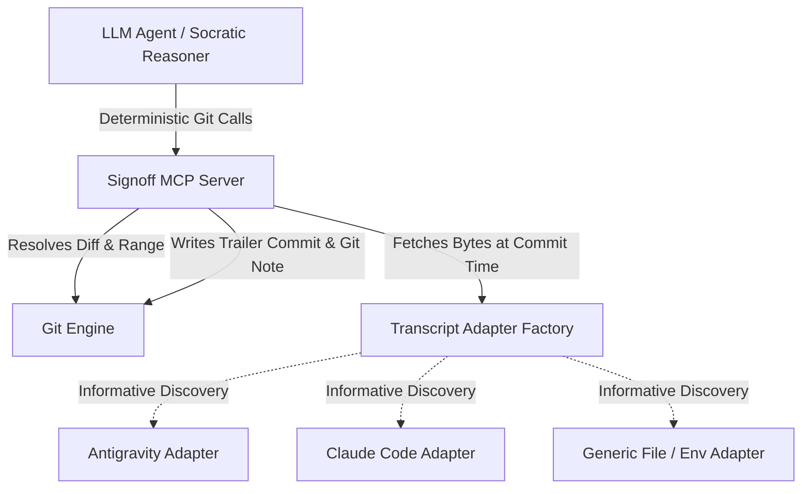

# Specification: Portable Git Signoff Attestation (GSA) Protocol Core

**Document Version:** 3.1.1  
**Status:** Draft / Pending Review (Stage 1a)  
**Target Scope:** `signoff` skill portability, MCP Server, Harness Adapters, Git Notes Attestation, and Open Commit Protocol Core  
**Canonical Spec Location:** `skills/signoff/specs/gsa-core.md`  

---

## 1. Executive Summary & Philosophy

The **Git Signoff Attestation (GSA) Protocol** defines an open, harness- and model-agnostic specification for AI-assisted human code attestation.

### 1.1 Core Purpose & Trust Model
* **Accountability & Audit Trail:** GSA provides a structured, machine-parsable audit log of human comprehension, intent, and risk acceptance inside Git.
* **Honest Trust Boundary:** GSA does not claim unforgeable proof of human cognition. Instead, it pairs Socratic agent interrogation with Git state verification, Git Notes persistence, and optional GPG/SSH signed commits (`git commit -S`) to establish verifiable human accountability.

---

## 2. Protocol Specification: Standardized Git Attestation Format

Attestations are recorded as empty Git commits (`git commit --allow-empty`) on feature branches AND mirrored into dedicated Git Notes (`refs/notes/signoff`) to guarantee survival across squash merges and branch deletions.

### 2.1 Commit & Note Metadata Schema

```text
[SIGNOFF <reviewed-commit-short-sha>]: human comprehension and risk attestation

<optional Socratic review summary paragraph>

Signoff-Spec-Version: 1.0
Signoff-Status: <STATUS>
Signoff-Timestamp: <ISO-8601 UTC timestamp>
Signoff-Base-SHA: <merge-base-sha>
Signoff-Reviewed-Commit-SHA: <reviewed-commit-sha>
Signoff-Reviewed-Tree-SHA: <reviewed-tree-sha>
Signoff-Harness-ID: <harness-id>
Signoff-Conversation-ID: <conversation-id-or-unavailable>
Signoff-Transcript-Digest: <transcript-digest-or-unavailable>
Signoff-Transcript-Bytes: <byte-count-or-unavailable>
Signoff-Tradeoff: <acknowledged-tradeoff-1>
Signoff-Tradeoff: <acknowledged-tradeoff-2>
Signoff-Risk: <acknowledged-risk-1>
Signoff-Verified-By: <confirmed-user-email>
Signoff-Agent: <agent-name-and-model>
```

*(Note: Optional cloud trailers like `Signoff-Cloud-Attestation-URL` are omitted entirely when unconfigured rather than written as `none`.)*

### 2.2 Status Field Enum & Server Enforcement

| Status Value | Meaning | Server Derivation & Enforcement Logic |
|---|---|---|
| `VERIFIED_BY_HUMAN` | Socratic interview completed; transcript resolved and hashed successfully. | Automatically set by MCP server if `TranscriptProvider` returns valid bytes and digest. |
| `VERIFIED_BY_HUMAN_NO_TRANSCRIPT_DIGEST` | Socratic interview completed; transcript unavailable locally. | Set by MCP server ONLY if `TranscriptProvider` returns `None` AND caller passes `ack_no_transcript=True`. If `ack_no_transcript=False`, server MUST abort commit with error. |

*(Note: `Signoff-Status` is derived deterministically by the MCP server; callers CANNOT override status string directly.)*

### 2.3 Field Rules & Conventions
- `Signoff-Spec-Version`: `1.0` (standalone machine-parsable protocol version).
- `Signoff-Base-SHA`: Computed dynamically via `git merge-base <reference-commit> <reviewed-commit-sha>` (no hardcoded remote assumptions).
- `Signoff-Reviewed-Commit-SHA`: 40-character SHA of commit inspected during interview.
- `Signoff-Reviewed-Tree-SHA`: 40-character tree SHA (`git rev-parse <reviewed-commit-sha>^{tree}`). Primary anchor for squash-merge / rebase verification.
- `Signoff-Transcript-Digest` & `Signoff-Transcript-Bytes`:
  - **Snapshot Timing:** The byte count and SHA256 digest MUST be captured synchronously inside `signoff_commit` upon final user approval, immediately before writing the commit/note.
  - The digest is calculated strictly over the first `Signoff-Transcript-Bytes` of the transcript file captured at commit time.
  - *Append-only Assumption:* First-N-bytes re-verification assumes append-only transcript logs. For harnesses with compaction/resume overwrites, mirroring transcript payloads to `refs/notes/signoff` or cloud archives provides complete immutability.
- `Signoff-Tradeoff` & `Signoff-Risk`:
  - **Repeat Rule:** Repeat the trailer key for each item acknowledged during interview.
  - **Empty Rule:** Write `Signoff-Tradeoff: none` or `Signoff-Risk: none` exactly once if zero items were identified.

### 2.4 Cryptographic Developer Identity Binding
To bind an attestation to a verified human developer identity:
* Implementations SHOULD execute `git commit -S --allow-empty` when GPG/SSH commit signing keys (`user.signingkey`) are configured in the local Git environment.
* Attestations can be validated using `git verify-commit <attestation-sha>` and platform status flags (e.g., GitHub Verified status).

### 2.5 Attestation Persistence & Concurrency via Git Notes (`refs/notes/signoff`)
To ensure attestations survive post-merge branch deletion and squash merges:
1. Every signoff execution writes the trailer payload to an empty commit AND attaches it to `refs/notes/signoff` on `<reviewed-commit-sha>` and `<reviewed-tree-sha>`.
2. **Concurrency Merge Strategy:** To prevent non-fast-forward push rejections in multi-developer environments, pushes MUST fetch remote notes into a separate tracking ref, merge them into the local signoff notes ref using the `cat_sort_uniq` strategy, and only then push:
   ```bash
   git fetch origin +refs/notes/signoff:refs/notes/signoff-remote
   git notes --ref=signoff merge -s cat_sort_uniq refs/notes/signoff-remote
   git push origin refs/notes/signoff
   ```
   Fetching directly into the local `refs/notes/signoff` is a non-fast-forward update whenever local and remote notes have diverged and is rejected; the `+`-forced tracking ref sidesteps this on repeat runs, and `--ref=signoff` ensures the merge targets the signoff notes ref rather than the default `refs/notes/commits`.

---

## 3. Pluggable Architecture: Adapters & Deterministic Engine



### 3.1 `TranscriptProvider` Minimal Interface Specification

To guarantee identical hashing across all adapters, the adapter is responsible only for locating and fetching raw transcript bytes; the GSA core engine computes digests and byte offsets.

```python
from typing import Protocol

class TranscriptProvider(Protocol):
    """Minimal interface for transcript discovery across AI agent runtimes."""
    
    def resolve_conversation_id(self) -> str | None:
        """Returns the active conversation/session ID string, or None if unresolvable."""
        ...
        
    def fetch_transcript_bytes(self) -> bytes | None:
        """Returns raw transcript file bytes as a snapshot at call time, or None if unavailable."""
        ...
```

### 3.2 Informative Harness Adapter Reference Matrix

*Harness storage formats are non-normative and adapter-owned.*

1. **`AntigravityAdapter`**:
   - Env: `ANTIGRAVITY_CONVERSATION_ID`
   - Path: `~/.gemini/antigravity-cli/brain/{cid}/.system_generated/logs/transcript.jsonl`
2. **`ClaudeCodeAdapter`**:
   - Env: `CLAUDE_CODE_SESSION_ID`
   - Path: `~/.claude/projects/<cwd-path-slug>/<session-id>.jsonl` (where `<cwd-path-slug>` is absolute working directory path with `/` converted to `-`).
3. **`GenericFileAdapter`**:
   - Env: `SIGNOFF_TRANSCRIPT_FILE=/path/to/transcript.log`

---

## 4. Scoped Model Context Protocol (MCP) Interface

The Socratic interrogation logic (probing 4 axes, evaluating user clarity) remains in the LLM agent prompt. The MCP server is strictly scoped to **deterministic Git state and diff mechanics**.

### 4.1 MCP Tools

* **`signoff_prepare(target_ref: str)`**:
  - Resolves `reviewed_commit_sha`, `base_sha`, and `tree_sha`.
  - Generates raw range diff, modified file list, and patch stats for LLM Socratic auditing.
  - Detects active `TranscriptProvider` and returns current transcript status (informative only).
* **`signoff_commit(tradeoffs: list[str], risks: list[str], user_email: str, sign_commit: bool = True, ack_no_transcript: bool = False)`**:
  - **Stale State Circuit Breaker:** Re-verifies `HEAD == reviewed_commit_sha`, `git diff --quiet`, and `git diff --cached --quiet`. Aborts if dirty or stale.
  - **Deterministic Status & Ack Enforcement:** Calls `TranscriptProvider.fetch_transcript_bytes()`. If transcript is unavailable and `ack_no_transcript=False`, server MUST abort execution. If `ack_no_transcript=True`, server sets `Signoff-Status: VERIFIED_BY_HUMAN_NO_TRANSCRIPT_DIGEST`.
  - Constructs flat GSA trailers, executes empty commit (`git commit --allow-empty [-S]`), and attaches Git Note (`refs/notes/signoff`).

---

## 5. Post-Squash & Rebase Survival Verification Algorithm

When feature branches are squash-merged or rebased, commit SHAs change and empty attestation commits are omitted from the target branch.

### 5.1 Verification Lookup Order
To verify if a target commit or tree was attested:
1. **Git Notes Lookup (`refs/notes/signoff`):** Check `git notes --ref=signoff show <commit-sha>` or `git notes --ref=signoff show <tree-sha>`. If a note exists, parse trailers directly.
2. **Git Log Attestation Commit Lookup:** If notes are un-fetched, search git log for commit messages matching `[SIGNOFF *]`.
3. **Tree-SHA Fallback:** If commit SHA is missing, compare `Signoff-Reviewed-Tree-SHA` against tree SHAs (`git rev-parse <commit>^{tree}`) in `refs/notes/signoff` or git log. If tree SHAs match, the attestation is verified valid for that exact code state.

---

## 6. Phase Gate Status

- [x] Stage 1a (Revised v3.1.1): Core GSA Spec finalized with repo-relative paths (`skills/signoff/specs/gsa-core.md`), Git Notes concurrency merge handling (`cat_sort_uniq` via tracking ref), and `ack_no_transcript` parameter circuit breaker.
- [x] Stage 1b: Implementation plan drafted, reviewed, and executed.
- [x] Phase 1 (Skill-Level Compliance): `skills/signoff/SKILL.md` implements GSA v1.0 trailers, portable harness adapter resolution (`SIGNOFF_TRANSCRIPT_FILE` → `ANTIGRAVITY_CONVERSATION_ID` → `CLAUDE_CODE_SESSION_ID` with worktree `--git-common-dir` fallback), signed attestation commits, and `refs/notes/signoff` dual persistence, enforced by agent instructions and covered by `scripts/tests/test_skill_references.py`.
- [x] Phase 2: `signoff-mcp` package (`signoff_mcp/`) — programmatic `TranscriptProvider` adapters (incl. worktree fallback and an additive Codex adapter; §3.2 is informative), MCP tools `signoff_prepare`/`signoff_commit`/`signoff_push_notes` with server-derived status, the `ack_no_transcript` circuit breaker, stale-state checks (§4), and `cat_sort_uniq` notes push flow (§2.5). Covered by `signoff_mcp/tests/`, including the production `[SIGNOFF 453c633]` attestation as a test vector (whose stale trailer tree SHA documents the failure class server-side derivation eliminates).
- [ ] Phase 3a (Portability): per-harness install & portability guide (`skills/signoff/HARNESSES.md`); skill folder self-contained for copy-paste installation as a user-level Claude Code skill.
- [ ] Phase 3b (Dogfood): end-to-end `/signoff` runs on Claude Code web, Antigravity (ongoing), and ChatGPT Codex. Exit gate: one pushed attestation per harness in `refs/notes/signoff`.
- [ ] Phase 4 (Extraction & Distribution): dedicated signoff GitHub repository (history carried via `git filter-repo`), consumed by this repo via submodule or subtree; project website (GitHub Pages first). The repo MUST double as a Claude Code plugin marketplace: `.claude-plugin/marketplace.json` at root plus a plugin manifest (`.claude-plugin/plugin.json`) wrapping the skill, so users install via claude.ai Directory → Plugins → "Add from a repository" (account-scoped; verify cloud-session sync during dogfood) or `/plugin marketplace add` on CLI/desktop. The plugin SHOULD also bundle the `signoff-mcp` MCP server (requires publishing to PyPI — reserve the package name) so one install delivers skill + server-side enforcement. Remaining channels, no repo linking anywhere: claude.ai skill zip upload (web user scope fallback; machine-local user plugins do not transfer to cloud sessions), repo-declared `.claude/settings.json` plugin for team repos, self-contained folder copy for other harnesses per `skills/signoff/HARNESSES.md`.
- [ ] Phase 5 (Cloud): promote `gsa-cloud-concept.md` to a reviewed spec (privacy/encryption design first), then transcript escrow storage. Payment options deferred until a non-trivial user base exists.
