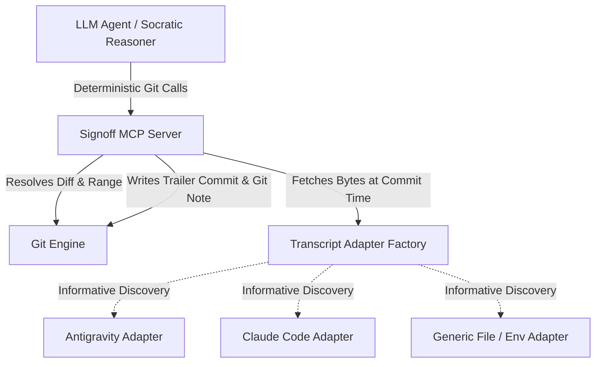

# Specification: Portable Git Signoff Attestation (GSA) Protocol Core

**Document Version:** 3.4.0 (adds the specification license declaration)  
**Status:** Draft / Pending Review (Stage 1a)  
**Target Scope:** `signoff` skill portability, MCP Server, Harness Adapters, Git Notes Attestation, and Open Commit Protocol Core  
**Canonical Spec Location:** `skills/signoff/specs/gsa-core.md`  
**License:** This specification is licensed under the [Community Specification License 1.0](https://github.com/jerrylin96/signoff/blob/main/LICENSE-SPEC) (SPDX: `Community-Spec-1.0`); the reference implementations in this repository remain MIT.  

---

## 1. Executive Summary & Philosophy

The **Git Signoff Attestation (GSA) Protocol** defines an open, harness- and model-agnostic specification for AI-assisted human code attestation.

### 1.1 Core Purpose & Trust Model
* **Accountability & Audit Trail:** GSA provides a structured, machine-parsable audit log of human comprehension, intent, and risk acceptance inside Git.
* **Honest Trust Boundary:** GSA does not claim unforgeable proof of human cognition. Instead, it pairs Socratic agent interrogation with Git state verification, Git Notes persistence, and optional GPG/SSH signed commits (`git commit -S`) to establish verifiable human accountability.

---

## 2. Protocol Specification: Standardized Git Attestation Format

Attestations are recorded as empty Git commits (`git commit --allow-empty`) on feature branches AND mirrored into dedicated Git Notes (`refs/notes/signoff`) to guarantee survival across squash merges and branch deletions.

### 2.1 Commit & Note Metadata Schema

```text
[SIGNOFF <reviewed-commit-short-sha>]: human comprehension and risk attestation

<optional Socratic review summary paragraph>

Signoff-Spec-Version: 1.0
Signoff-Status: <STATUS>
Signoff-Timestamp: <ISO-8601 UTC timestamp>
Signoff-Base-SHA: <merge-base-sha>
Signoff-Reviewed-Commit-SHA: <reviewed-commit-sha>
Signoff-Reviewed-Tree-SHA: <reviewed-tree-sha>
Signoff-Harness-ID: <harness-id>
Signoff-Conversation-ID: <conversation-id-or-unavailable>
Signoff-Transcript-Digest: <transcript-digest-or-unavailable>
Signoff-Transcript-Bytes: <byte-count-or-unavailable>
Signoff-Tradeoff: <acknowledged-tradeoff-1>
Signoff-Tradeoff: <acknowledged-tradeoff-2>
Signoff-Risk: <acknowledged-risk-1>
Signoff-Verified-By: <confirmed-user-email>
Signoff-Agent: harness=<harness-id>/<version|N/A> model=<model-id|N/A> reasoning=<level|N/A> interview=<intensity-level>/<profile-id>[/sha256:<profile-digest-prefix>]
```

*(Note: Optional cloud trailers like `Signoff-Cloud-Attestation-URL` are omitted entirely when unconfigured rather than written as `none`.)*

### 2.2 Status Field Enum & Server Enforcement

| Status Value | Meaning | Server Derivation & Enforcement Logic |
|---|---|---|
| `VERIFIED_BY_HUMAN` | Socratic interview completed; transcript resolved and hashed successfully. | Automatically set by MCP server if `TranscriptProvider` returns valid bytes and digest. |
| `VERIFIED_BY_HUMAN_NO_TRANSCRIPT_DIGEST` | Socratic interview completed; transcript unavailable locally. | Set by MCP server ONLY if `TranscriptProvider` returns `None` AND caller passes `ack_no_transcript=True`. If `ack_no_transcript=False`, server MUST abort commit with error. |

*(Note: `Signoff-Status` is derived deterministically by the MCP server; callers CANNOT override status string directly.)*

### 2.3 Field Rules & Conventions
- **Trailer keys are case-sensitive** and MUST be written exactly as shown in §2.1 (`Signoff-Spec-Version`, `Signoff-Reviewed-Tree-SHA`, …). Verifiers MUST NOT match case variants: a case-variant key is not that trailer, so a payload whose mandatory trailers appear only in variant casing is invalid. (Clarified after two implementations disagreed; the conformance suite pins this via `invalid-lowercase-keys.txt`.)
- `Signoff-Spec-Version`: `1.0` (standalone machine-parsable protocol version).
- `Signoff-Base-SHA`: Computed dynamically via `git merge-base <reference-commit> <reviewed-commit-sha>` (no hardcoded remote assumptions).
- `Signoff-Reviewed-Commit-SHA`: 40-character SHA of commit inspected during interview.
- `Signoff-Reviewed-Tree-SHA`: 40-character tree SHA (`git rev-parse <reviewed-commit-sha>^{tree}`). Primary anchor for squash-merge / rebase verification.
- `Signoff-Transcript-Digest` & `Signoff-Transcript-Bytes`:
  - **Snapshot Timing:** The byte count and SHA256 digest MUST be captured synchronously inside `signoff_commit` upon final user approval, immediately before writing the commit/note.
  - The digest is calculated strictly over the first `Signoff-Transcript-Bytes` of the transcript file captured at commit time.
  - *Append-only Assumption:* First-N-bytes re-verification assumes append-only transcript logs. For harnesses with compaction/resume overwrites, mirroring transcript payloads to `refs/notes/signoff` or cloud archives provides complete immutability.
- `Signoff-Tradeoff` & `Signoff-Risk`:
  - **Repeat Rule:** Repeat the trailer key for each item acknowledged during interview.
  - **Empty Rule:** Write `Signoff-Tradeoff: none` or `Signoff-Risk: none` exactly once if zero items were identified.
- `Signoff-Agent` (Interviewer Provenance):
  - **Grammar (SHOULD):** `harness=<id>/<version|N/A> model=<model-id|N/A> reasoning=<level|N/A> interview=<intensity-level>/<profile-id>[/sha256:<profile-digest-prefix>]` — space-separated `key=value` tokens in this fixed order, each value matching `[A-Za-z0-9._:/-]+`; the literal `N/A` marks fields the harness does not expose. The optional `/sha256:<profile-digest-prefix>` segment (12-hex prefix of the SHA256 of the delimited profile block) is REQUIRED when the interview profile was resolved from a file (resolution order defined in the skill layer: `SIGNOFF_PROFILE_FILE` env override → `<repo>/.signoff/profile.md` → embedded default block) and MUST be omitted when the embedded shipped block ran — verifiers can thereby distinguish shipped question sets from repo-authored ones.
  - **Sourcing:** `harness` mirrors `Signoff-Harness-ID` plus the harness version. `model` and `reasoning` identify the interviewing agent, deterministically sourced where the harness provides them (environment variables, transcript metadata from the same snapshot bytes as the digest), agent-self-reported otherwise. `interview` records the interview-intensity level actually run and the active INTERVIEW PROFILE identifier (both defined in the skill layer, `skills/signoff/SKILL.md`).
  - **Backward Compatibility:** Values not matching this grammar (including all pre-3c attestations) remain valid opaque strings; verifiers MUST NOT reject an attestation on `Signoff-Agent` format.

### 2.4 Cryptographic Developer Identity Binding
To bind an attestation to a verified human developer identity:
* Implementations SHOULD execute `git commit -S --allow-empty` when GPG/SSH commit signing keys (`user.signingkey`) are configured in the local Git environment.
* Attestations can be validated using `git verify-commit <attestation-sha>` and platform status flags (e.g., GitHub Verified status).

### 2.5 Attestation Persistence & Concurrency via Git Notes (`refs/notes/signoff`)
To ensure attestations survive post-merge branch deletion and squash merges:
1. Every signoff execution writes the trailer payload to an empty commit AND attaches it to `refs/notes/signoff` on `<reviewed-commit-sha>` and `<reviewed-tree-sha>`.
2. **Concurrency Merge Strategy:** To prevent non-fast-forward push rejections in multi-developer environments, pushes MUST fetch remote notes into a separate tracking ref, merge them into the local signoff notes ref using the `cat_sort_uniq` strategy, and only then push:
   ```bash
   git fetch origin +refs/notes/signoff:refs/notes/signoff-remote
   git notes --ref=signoff merge -s cat_sort_uniq refs/notes/signoff-remote
   git push origin refs/notes/signoff
   ```
   Fetching directly into the local `refs/notes/signoff` is a non-fast-forward update whenever local and remote notes have diverged and is rejected; the `+`-forced tracking ref sidesteps this on repeat runs, and `--ref=signoff` ensures the merge targets the signoff notes ref rather than the default `refs/notes/commits`.

---

## 3. Pluggable Architecture: Adapters & Deterministic Engine



### 3.1 `TranscriptProvider` Minimal Interface Specification

To guarantee identical hashing across all adapters, the adapter is responsible only for locating and fetching raw transcript bytes; the GSA core engine computes digests and byte offsets.

```python
from typing import Protocol

class TranscriptProvider(Protocol):
    """Minimal interface for transcript discovery across AI agent runtimes."""
    
    def resolve_conversation_id(self) -> str | None:
        """Returns the active conversation/session ID string, or None if unresolvable."""
        ...
        
    def fetch_transcript_bytes(self) -> bytes | None:
        """Returns raw transcript file bytes as a snapshot at call time, or None if unavailable."""
        ...
```

### 3.2 Informative Harness Adapter Reference Matrix

*Harness storage formats are non-normative and adapter-owned.*

1. **`AntigravityAdapter`**:
   - Env: `ANTIGRAVITY_CONVERSATION_ID`
   - Path: `~/.gemini/antigravity-cli/brain/{cid}/.system_generated/logs/transcript.jsonl`
2. **`ClaudeCodeAdapter`**:
   - Env: `CLAUDE_CODE_SESSION_ID`
   - Path: `~/.claude/projects/<cwd-path-slug>/<session-id>.jsonl` (where `<cwd-path-slug>` is absolute working directory path with `/` converted to `-`).
3. **`GenericFileAdapter`**:
   - Env: `SIGNOFF_TRANSCRIPT_FILE=/path/to/transcript.log`

---

## 4. Scoped Model Context Protocol (MCP) Interface

The Socratic interrogation logic (probing 4 axes, evaluating user clarity) remains in the LLM agent prompt. The MCP server is strictly scoped to **deterministic Git state and diff mechanics**.

### 4.1 MCP Tools

* **`signoff_prepare(target_ref: str)`**:
  - Resolves `reviewed_commit_sha`, `base_sha`, and `tree_sha`.
  - Generates raw range diff, modified file list, and patch stats for LLM Socratic auditing.
  - Detects active `TranscriptProvider` and returns current transcript status (informative only).
  - Reports the resolved interview profile (source, path, `Profile-ID`, 12-hex block digest — the skill-layer resolution order of §2.3, with an unreadable `SIGNOFF_PROFILE_FILE` aborting and a malformed file-sourced profile falling back to the embedded default with the reason surfaced) and the science-guard signal categories detected in the range diff (informative mirror of the skill layer's Section 1 step 5 and science-detection escalation guard; the agent prompt remains authoritative for interview conduct).
* **`signoff_commit(tradeoffs: list[str], risks: list[str], user_email: str, sign_commit: bool = True, ack_no_transcript: bool = False)`**:
  - **Stale State Circuit Breaker:** Re-verifies `HEAD == reviewed_commit_sha`, `git diff --quiet`, and `git diff --cached --quiet`. Aborts if dirty or stale.
  - **Deterministic Status & Ack Enforcement:** Calls `TranscriptProvider.fetch_transcript_bytes()`. If transcript is unavailable and `ack_no_transcript=False`, server MUST abort execution. If `ack_no_transcript=True`, server sets `Signoff-Status: VERIFIED_BY_HUMAN_NO_TRANSCRIPT_DIGEST`.
  - Constructs flat GSA trailers, executes empty commit (`git commit --allow-empty [-S]`), and attaches Git Note (`refs/notes/signoff`).

---

## 5. Post-Squash & Rebase Survival Verification Algorithm

When feature branches are squash-merged or rebased, commit SHAs change and empty attestation commits are omitted from the target branch.

### 5.1 Verification Lookup Order
To verify if a target commit or tree was attested:
1. **Git Notes Lookup (`refs/notes/signoff`):** Check `git notes --ref=signoff show <commit-sha>` or `git notes --ref=signoff show <tree-sha>`. If a note exists, parse trailers directly.
2. **Git Log Attestation Commit Lookup:** If notes are un-fetched, search git log for commit messages matching `[SIGNOFF *]`.
3. **Tree-SHA Fallback:** If commit SHA is missing, compare `Signoff-Reviewed-Tree-SHA` against tree SHAs (`git rev-parse <commit>^{tree}`) in `refs/notes/signoff` or git log. If tree SHAs match, the attestation is verified valid for that exact code state.

---

## 6. Phase Gate Status

*Process note: before ending a session, adversarially review any plan changes and the next session's kickoff prompt (attack ordering, over-claims, hidden costs, and required user actions), then end the branch with `/signoff`.*

- [x] Stage 1a (Revised v3.1.1): Core GSA Spec finalized with repo-relative paths (`skills/signoff/specs/gsa-core.md`), Git Notes concurrency merge handling (`cat_sort_uniq` via tracking ref), and `ack_no_transcript` parameter circuit breaker.
- [x] Stage 1b: Implementation plan drafted, reviewed, and executed.
- [x] Phase 1 (Skill-Level Compliance): `skills/signoff/SKILL.md` implements GSA v1.0 trailers, portable harness adapter resolution (`SIGNOFF_TRANSCRIPT_FILE` → `ANTIGRAVITY_CONVERSATION_ID` → `CLAUDE_CODE_SESSION_ID` with worktree `--git-common-dir` fallback), signed attestation commits, and `refs/notes/signoff` dual persistence, enforced by agent instructions and covered by `scripts/tests/test_skill_references.py`.
- [x] Phase 2: `signoff-mcp` package (`signoff_mcp/`) — programmatic `TranscriptProvider` adapters (incl. worktree fallback and an additive Codex adapter; §3.2 is informative), MCP tools `signoff_prepare`/`signoff_commit`/`signoff_push_notes` with server-derived status, the `ack_no_transcript` circuit breaker, stale-state checks (§4), and `cat_sort_uniq` notes push flow (§2.5). Covered by `signoff_mcp/tests/`, including the production `[SIGNOFF 453c633]` attestation as a test vector (whose stale trailer tree SHA documents the failure class server-side derivation eliminates).
- [x] Phase 3a (Portability): per-harness install & portability guide (`skills/signoff/HARNESSES.md`); skill folder self-contained for copy-paste installation as a user-level Claude Code skill. Shipped 2026-08-05: external skill links reduced to graceful-degradation references; enforced by `scripts/tests/test_skill_references.py::test_skill_folder_is_self_contained` in the standalone repo.
- [x] Phase 3b (Dogfood): end-to-end `/signoff` runs on Claude Code web, Antigravity (ongoing), and ChatGPT Codex. Exit gate: one pushed attestation per harness in `refs/notes/signoff`. **Evidence 2026-08-05 (Claude Code web):** end-to-end run on this repo produced attestation `ad1f5ee`, carried into `main` via the PR #1 true merge — so the §5.1 git-log `[SIGNOFF *]` lookup finds it directly without notes. The embedded-default profile ran (no digest segment, per §2.3), and the science-detection guard correctly declined to escalate on a docs-only diff. The `refs/notes/signoff` push was 403-blocked by the cloud git proxy (known limitation, HARNESSES.md); notes recovery by re-pushing from an unrestricted clone remains pending, so the Claude Code web exit gate (pushed note) stays open on that one step. A second web attestation (`0c54122`, the Phase 3e live dogfood) is likewise in `main` via the PR #2 true merge; its notes push hit the same 403, so both note payloads (reconstructable from the attestation commit messages) await re-push from an unrestricted clone. **Recovery mechanism shipped 2026-08-06** (Phase 5 Gate 0): the `notes-recovery` workflow reconstructs and pushes `refs/notes/signoff` from `main`'s attestation messages on every push to `main`; this gate's remaining step closes automatically when the Phase 5 branch merges and the workflow's first run pushes the ref — verify `git ls-remote origin refs/notes/signoff` next session. **Ticked 2026-08-06 (post-merge verification):** `git ls-remote origin refs/notes/signoff` resolves (`9112fc0`), pushed by the first `notes-recovery` run on `main` (run 31109240282, success, on the PR #4 merge commit `1550350`) — 26 note entries covering the reviewed commit *and* tree of every `[SIGNOFF *]` attestation in `main`'s history, spot-verified to carry the full attestation messages (the `a4afbfe` note reproduces its four-axis summary; the recovered pre-extraction `453c633` fixture note parses with `Signoff-Harness-ID: antigravity-cli`). The exit gate — a pushed attestation per harness — is met for `claude-code` (both web attestations, `ad1f5ee`/`0c54122` lineage) and `antigravity-cli` (recovered fixture); a Codex end-to-end run never materialized and is recorded as a seeding-era item (the Codex adapter ships in `signoff_mcp` and HARNESSES.md), not a merge blocker.
- [x] Phase 3c (Interview Customization & Transparency): (1) attestations record interviewer provenance — harness, model, and reasoning level (`N/A` when the harness exposes none) — via a defined `Signoff-Agent` format (§2.3), deterministically sourced where the harness provides it; (2) named interview-intensity levels spanning cursory (high-level comprehension check) to skeptical (user must demonstrably prove understanding), formalizing the `--quick`/`--deep` modifiers with explicit probe counts and pass criteria per level; (3) SKILL.md restructured to be modular: fixed universal axes applied to every reviewer (edge cases, boundary conditions, failure loudness, ownership) plus exactly one clearly-delimited swappable INTERVIEW PROFILE text block for domain customization (shipped profiles in `skills/signoff/profiles/`: `software-general` for efficiency/data-structures, `domain-science` for research validity), with external-user documentation in `skills/signoff/HARNESSES.md` stating that this block — and only this block — is the customization point. Contract enforced by `scripts/tests/test_skill_references.py::test_signoff_phase3c_interview_contract`.
- [x] Phase 4 (Extraction & Distribution): dedicated signoff GitHub repository (history carried via `git filter-repo`), consumed by this repo via submodule or subtree; project website (GitHub Pages first). The repo MUST double as a Claude Code plugin marketplace: `.claude-plugin/marketplace.json` at root plus a plugin manifest (`.claude-plugin/plugin.json`) wrapping the skill, so users install via claude.ai Customize → Plugins → Add → "Add marketplace" → "Add from a repository" (account-scoped; install path verified 2026-08-05; cloud sessions register the plugin as enabled but do not yet load its bundled skill — see Status) or `/plugin marketplace add` on CLI/desktop. The plugin SHOULD also bundle the `signoff-mcp` MCP server (requires publishing to PyPI — reserve the package name) so one install delivers skill + server-side enforcement. Remaining channels, no repo linking anywhere: claude.ai skill zip upload (web user scope fallback; machine-local user plugins do not transfer to cloud sessions), repo-declared `.claude/settings.json` plugin for team repos, self-contained folder copy for other harnesses per `skills/signoff/HARNESSES.md`. **Status 2026-08-05:** shipped pending verification — dedicated repo `jerrylin96/signoff` carries full `git filter-repo` history plus marketplace/plugin manifests at root; dotgemini consumes it via two `git subtree --squash` prefixes (`scripts/sync_signoff_subtree.sh`); GitHub Pages, PyPI publish, and MCP bundling inside the plugin remain deferred; marketplace add + plugin install verified on claude.ai 2026-08-05 (under Customize → Plugins, not the Directory — docs corrected). Cloud-sync dogfood result 2026-08-05: the plugin syncs account-wide (cloud sessions list it enabled) but its bundled skill does not load there — a fresh cloud session on an unrelated repo reports "Unknown command: /signoff" — so the zip upload remains the operative web channel (the sanctioned fallback) and the plugin remains primary for CLI/desktop. Ticked 2026-08-05: `/signoff` loads in fresh cloud sessions on unrelated projects via the account-scoped zip channel (CI-built `v0.1.0` release asset). Account-scoped plugin installs still don't load bundled skills in cloud sessions — platform gap, re-test periodically; project website (GitHub Pages) remains a deferred follow-up alongside PyPI publish and MCP bundling.
- [x] Phase 3d (Research Accessibility): make the interview genuinely usable by scientists, physicists, and mathematicians — not only software engineers — without weakening rigor. Rationale: research code's dominant failure mode is plausible-but-invalid results, and at the frontier there is no oracle to check against; the interview's honest claim there is auditing the human's grasp of assumptions and validity regimes, not correctness. Four gates: (1) **Repo-local profile selection** — the *target repository* may carry `.signoff/profile.md` containing exactly one delimited INTERVIEW-PROFILE block; when present and well-formed it overrides the block embedded in `SKILL.md` (resolution order: `SIGNOFF_PROFILE_FILE` env override → `<repo>/.signoff/profile.md` → embedded block). This replaces editing the installed `SKILL.md` as the user-facing customization path — managed plugin installs overwrite such edits on update, so today the sole customization point is effectively unreachable on the primary channels. Profiles stay emphases-only: they may weight probes within the universal axes, never remove axes or lower pass criteria. (2) **Science-detection escalation guard, on by default** — during range-diff inspection, content signaling scientific computation (scientific-stack imports such as numpy/scipy/jax/astropy, notebooks, RNG seeding, physical constants or unit-bearing quantities, dataset/model-config files) forces the `domain-science` emphases *additively* on top of whatever profile is active, mirroring the existing one-way cursory-eligibility escalation: a diff that touches science gets science probes even under `software-general`. (3) **Profile provenance** — once the interviewee's own repository can author the questions, attestations must record which question set actually ran: keep `<profile-id>` in `Signoff-Agent` and extend the `interview=` token with the SHA256 digest of the active profile block (e.g. `interview=<level>/<profile-id>/sha256:<digest-prefix>`), backward-compatible under §2.3's opaque-string rule, so verifiers can distinguish a rigorous profile from a diluted one. (4) **Plain-language on-ramp** — README leads with a researcher-facing explanation of what the tool does, who it is for, how to run it, and a copy-paste walkthrough for customizing the questions to a lab's failure modes; `profiles/domain-science.md` gains numerical-stability (conditioning, cancellation, tolerance/convergence choices) and uncertainty-quantification emphases. **Status 2026-08-05:** shipped — gate 1 as SKILL.md Section 1 step 5 (file-sourced profile resolution with announced fallback to the embedded default on malformed input; `SIGNOFF_PROFILE_FILE` aborts rather than falls back when unreadable), gate 2 as an additive default-on guard wired into cursory eligibility, gate 3 as the optional `/sha256:<profile-digest-prefix>` segment of the `interview=` token (§2.1/§2.3 — REQUIRED for file-sourced profiles, omitted for the embedded block), gate 4 as the README on-ramp plus numerical-stability and uncertainty-quantification emphases in `profiles/domain-science.md` (illustrative examples repo-wide use earth/atmospheric science, per repo convention, while mechanics stay domain-neutral). Enforced by `scripts/tests/test_skill_references.py::test_signoff_phase3d_research_accessibility_contract`.
- [x] Phase 3e (Runtime Verification & Distribution of Phase 3d): Phase 3d shipped at the prompt level and is pinned by contract tests, but no live run has yet exercised the new machinery, and no distribution channel ships it. Three sub-gates: (1) **Live dogfood of repo-local profiles + science guard** — a `/signoff` run against a diff touching real scientific code, with a repo-local `.signoff/profile.md` carrying a custom `Profile-ID`, verifying: the profile source is announced before the first probe, the science-detection guard fires on genuine signals, and the attestation trailer carries `interview=<level>/<custom-id>/sha256:<digest>`; plus the malformed-profile path (broken markers) verified to announce fallback to the embedded `software-general` default with no digest segment. (2) **Release cut** — cut `v0.2.0` via the `workflow_dispatch` release workflow so the CI-built `signoff.zip` carries Phase 3d; zip-channel users are snapshot-installed and otherwise stay on `v0.1.0` indefinitely. (3) **Optional `signoff-mcp` mirroring** — `signoff_prepare` deterministically reports the resolved profile source, its digest, and detected science signals (server-side mirror of SKILL.md Section 1 step 5 and the science-detection guard), with tests in `signoff_mcp/tests/`. **Sub-gate 1 mechanics evidence 2026-08-05:** this repo now carries the dogfood fixture in-tree — `.signoff/profile.md` (custom `Profile-ID: atmos-science-dogfood`, block digest `5fd075753d5b`, validity pinned by `scripts/tests/test_skill_references.py::test_repo_local_dogfood_profile_is_valid`) and `scripts/examples/ciwv.py` (numpy/xarray column-integrated water vapor on pressure levels; self-test verifies the constant-q closed form, level-ordering invariance, and loud failure on an hPa→Pa unit slip). A scripted run of Section 1 step 5 against a scratch target repo built from the fixture verified all four resolution paths: repo-local source resolved with digest `5fd075753d5b` and a §2.3-grammar-valid token `interview=standard/atmos-science-dogfood/sha256:5fd075753d5b`; `SIGNOFF_PROFILE_FILE` override takes precedence with a distinct digest; an unreadable override aborts (exit 1) rather than falling back; malformed markers yield zero delimited blocks → announced fallback to embedded `software-general` with no digest segment. The range diff carries genuine science-guard signals (numpy/xarray imports, `default_rng` seeding, hPa unit tokens, the standard-gravity constant). Because the fixture lives at this repo's own resolution path and this branch's diff touches the science script, the branch-ending live `/signoff` interview doubles as the live-run half of this sub-gate. **Sub-gate 2 shipped 2026-08-05:** `v0.2.0` cut via the `workflow_dispatch` release path (run #2, dispatched on the Phase 3e branch since the version bump cannot land on `main` from a cloud session; the tag enters `main` history with the branch's true merge). The CI-built `signoff.zip` asset was downloaded back and verified to carry the Phase 3d SKILL.md and this spec — zip-channel users re-downloading per the README now get Phase 3d. **Sub-gate 3 shipped 2026-08-05:** `signoff_mcp/profile.py` mirrors profile resolution (env override abort / repo-local / embedded fallback with surfaced reason) and science-signal detection; `signoff_prepare` reports both (§4.1). Digest parity with the SKILL.md `sed | sha256sum | cut` pipeline is pinned by `signoff_mcp/tests/test_profile_resolution.py`, and a live `prepare()` against this repo reproduced the fixture digest `5fd075753d5b` and flagged the branch diff's science signals. **Ticked 2026-08-06 — sub-gate 1 live half completed:** the branch-ending `/signoff` ran end-to-end as a live human interview (Claude Code web): repo-local profile source announced, science guard fired on the CIWV diff and applied `domain-science` additively, and attestation `0c54122` (`VERIFIED_BY_HUMAN`, `interview=standard/atmos-science-dogfood/sha256:5fd075753d5b` — the first attestation carrying a repo-local profile digest) reached `main` via the PR #2 true merge, alongside the v0.2.0 tag target. Only the notes re-push (Phase 3b exit gate) remains, blocked by the cloud proxy as acknowledged in the attestation itself. **Post-merge follow-up:** the dogfood profile was deliberately retired from the live resolution path — an atmospheric-science emphasis set should not silently govern this software repo's future signoffs — and archived as `scripts/examples/dogfood-profile.md` (the dogfood-only contract test went with it — the attestation, git history, and this entry are the durable record).
- [ ] Phase 3f (Adaptive Signoff Interview Intensity): Dynamic auto-classification of interview intensity based on diff semantics and blast radius when bare `/signoff` is invoked without explicit modifiers: Tier 0 (`cursory` for pure docs/types <50 LoC), Tier 1 (`standard` for default feature work, with pure docs of any size capped at Tier 1), and Tier 2 (`skeptical` for high-impact changes: security/auth, schema/migrations, public APIs, numerical/science invariants, or >200 LoC / >5 files). Safety clamps strictly block `--quick` on high-impact diffs and enforce graduated one-way escalation. Enforced by `scripts/tests/test_skill_references.py::test_signoff_phase3f_adaptive_intensity_contract`. Status: shipped at prompt level; live classification dogfood pending; release cut deferred to post-merge release workflow. Adaptive tiering is prompt-level only and is not mirrored server-side in signoff_mcp.
- [ ] Phase 5 (Cloud & Productionization — **high priority, start within the next few sessions**): take signoff from a local experimental tool to production-ready for a small but growing user base. Four gates: (0) **Notes-recovery automation** — a CI workflow that reconstructs `refs/notes/signoff` server-side from `[SIGNOFF *]` attestation messages in `main`'s history and pushes the ref (GitHub Actions is not behind the session git proxy, so this closes the twice-hit 403 gap and the Phase 3b exit gate without any cloud infrastructure). (1) **Dedicated project website** (GitHub Pages first — carried over from the Phase 4 deferral; enabling Pages is a repo-settings user action) as the public front door: what the tool does and for whom, per-surface install rows, profile-customization walkthrough, and links to the latest release zip and marketplace install. (2) **Cloud concept promoted to reviewed spec** — `gsa-cloud-concept.md` graduates from concept to reviewed spec, privacy design first: transcripts are whole dev conversations (secrets, proprietary code, non-consenting third parties), so the null hypothesis to beat is **user-owned storage** (their own bucket or private git ref) with client-side encryption — a centrally operated store makes the project a data controller and cost sink and must be explicitly justified, not assumed. (3) **Cloud storage for conversations** — transcript escrow per the reviewed spec, so `Signoff-Transcript-Digest` stays re-verifiable after ephemeral harness storage vanishes. Payment options remain deferred until a non-trivial user base exists. **Strategy (hosting, providers, database, pricing, moat) lives in `docs/productionization.md`** — a living review doc: website is static-first *and design-first* (bar set by the design polish of ndstudio.gov / americabydesign.gov; custom domain is the top credibility user action), infra and pricing decisions gate on the evidence milestones recorded there, and the moat strategy is open-protocol standardization over first-mover audience effects — end-state: GSA as a widely adopted cross-domain open standard, with a milestone path (spec licensing, conformance vectors, third-party implementation, in-toto predicate-type interop) toward donation to a neutral foundation such as the Linux Foundation / OpenSSF, whose attestation ecosystem (in-toto, SLSA, Sigstore) attests builds and provenance but not human comprehension. Iterate it adversarially whenever Phase 5 is touched. **Status 2026-08-06 — gates 0–2 shipped on the Phase 5 branch, pending post-merge verification:** Gate 0 as `scripts/recover_notes.py` + the `notes-recovery` workflow (idempotent plumbing-based reconstruction covering all attestations in `main` plus the pre-extraction `[SIGNOFF 453c633]` fixture, whose objects no longer exist in this repo — its note entry is resolvable in downstream clones that carry them; fires on every push to `main`, so future attestations self-heal; tested in `scripts/tests/test_recover_notes.py` incl. an end-to-end clone run). Gate 1 as `site/index.html` — a single self-contained static page (no external requests, dark-mode, no horizontal overflow at 320–1440px, verified headless) deployed by `pages.yml`; **user actions: enable Pages (Settings → Pages → Source: GitHub Actions) if the workflow's `enablement: true` attempt fails, and purchase the custom domain (top credibility item)**. Gate 2 as `specs/gsa-escrow.md` (reviewed draft; privacy design first; user-owned storage + client-side encryption as the normative baseline; operated registry gated on recorded evidence, ciphertext-only; cost model included) — `gsa-cloud-concept.md` removed per its lifecycle note. Gate 3 (escrow implementation) remains open and now gates on the escrow spec's evidence rules, not on more speculation. Also shipped, from the strategy doc's sharing-loop and standardization tracks: the **badge + CI verifier** (`verify/` composite action + stdlib-only single-file verifier implementing §5.1; dogfooded by this repo's `attested by humans` workflow and README badge — external adopters install in two minutes per `verify/README.md`), **spec licensing** (Community Specification License 1.0 in `LICENSE-SPEC`, declared by both specs), **conformance vectors** (`conformance/`, mostly real attestations, reference verifier pinned to `expected.json` in CI), and the **in-toto predicate-type draft** (`specs/gsa-in-toto-predicate.md`, provisional namespace). PyPI publish + MCP bundling remain deferred (need user credentials). **Post-merge verification 2026-08-06:** Gate 0 ✅ — see Phase 3b evidence: the ref exists on origin, the first `main` run of `notes-recovery` succeeded, and recovered note payloads parse. Gate 1 ⏳ blocked on the anticipated permission boundary: the `pages` run on the merge commit (run 31109242588) failed inside `actions/configure-pages` — "Get Pages site failed: Not Found" then "Create Pages site failed: Resource not accessible by integration" — i.e. the site does not exist and the workflow token may not auto-create it; the upload and deploy steps were skipped, so the failure is isolated to enablement and the shipped page itself is untouched. **User action: Settings → Pages → Source: GitHub Actions, then re-run `pages`.** The `attested by humans` check is green on both the PR #4 head (`3961d15`) and the `main` push, and the latest-release zip URL resolves (HTTP 200 — pointing at `v0.2.0` until the v0.3.0 cut below). github.io is unreachable from cloud sessions (proxy CONNECT 403), so the final site-resolves check must happen from a browser after enablement. **Release cut 2026-08-06:** `v0.3.0` (versions synchronized repo-wide) via Release run 31110205188, dispatched on the release branch at `f13aad9` per the v0.2.0 precedent; the latest-release `signoff.zip` was downloaded back and verified to ship `gsa-escrow.md`, `gsa-in-toto-predicate.md`, and the evidence-updated `gsa-core.md` with both Community-Spec-1.0 declarations — zip-channel users re-downloading now get the full Phase 5 spec set. Adopter pinning: `verify/README.md` install snippets now pin `jerrylin96/signoff/verify@verify-v1`; the tag itself could not be dispatched pre-merge (`workflow_dispatch` only reaches workflows already on the default branch, and direct tag pushes are proxy-403-blocked), so `tag.yml` self-heals — every push to `main` creates any missing pin tags at that commit — **verify `git ls-remote origin refs/tags/verify-v1` after this branch merges**. PyPI: `pypi-publish.yml` ships credential-free trusted publishing for `signoff-mcp`; publishing is blocked solely on the one-time PyPI-side trusted-publisher configuration (user action), after which a manual dispatch publishes 0.3.0. Discovery seeding: `docs/discovery-interview.md` (Mom-Test discipline, segment recruiting, and probes wired to the escrow evidence gates of `gsa-escrow.md` §5 and the pricing questions of `docs/productionization.md`; filled notes stay private).
